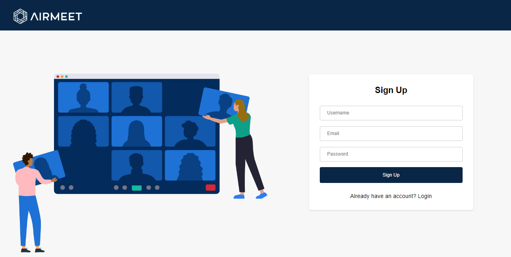
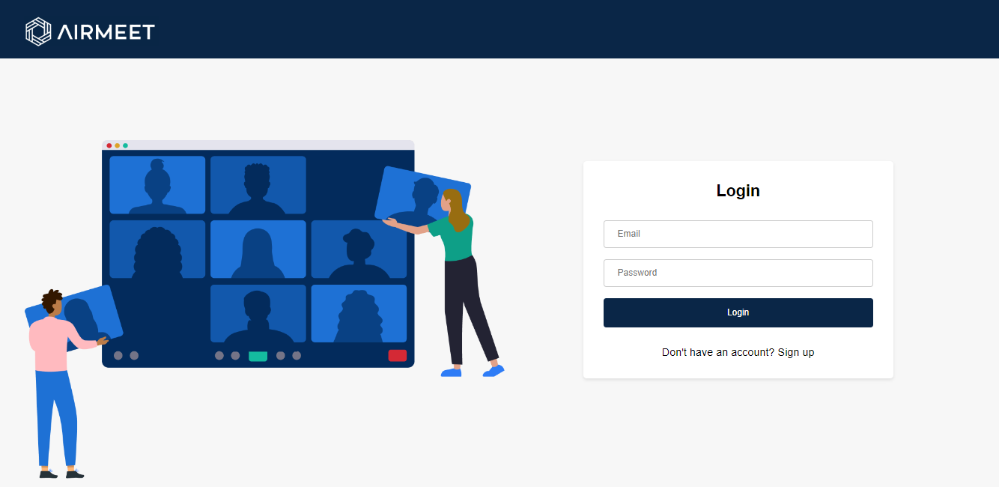
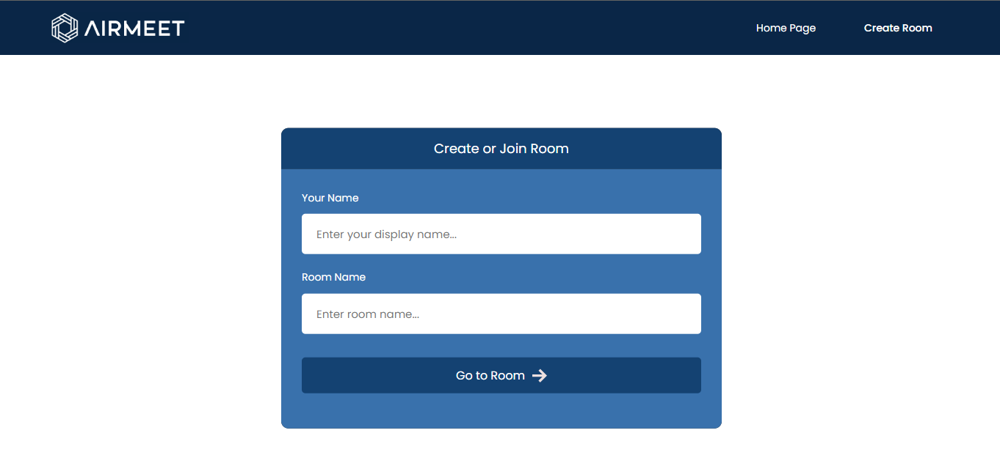
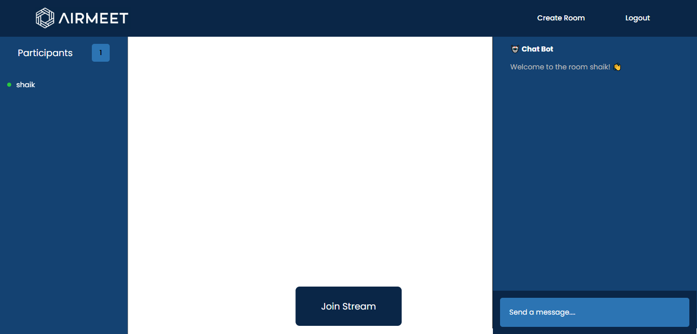
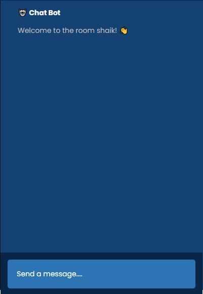

# AirMeet

This is a real-time video chat application built using Node.js, Express, MongoDB, Redis, and the Agora.io API. The application allows users to create video chat rooms and communicate with other users in real-time.

**Features:**

* Home page with information and images.
* Navbar with logo and signin/signup buttons.
* Signin and signup pages with forms to register and login.
* Authorization handled in the backend with Redis to store cache and JWT token system and refresh token.
* All data stored in MongoDB.
* Lobby page where users can create a room to do video chat with others.
* Main landing page with a list of participants, video streaming, and a chat session.
* Agora API is used for video and message parts.
* Logout button on the create room and video streaming landing page to redirect to the home page.
* Participants list displays the names of all the users in the room including the current user.
* Chatbot sends a welcome message with the name of the user when they enter the room.
* Users can join a stream by giving permission for microphone and camera in the browser.
* The video of the user is displayed in the middle section of the landing page in square boxes.
* Four options (toggle functions) are provided to turn on/off camera, mute/unmute voice, screen sharing, and leave stream.
* Chatbot sends a message when a user joins or leaves the room.
* Username with the message is displayed in the chat section when a user texts in the chat.
* The website is designed to be fully responsive and optimized for various screen sizes.

**Technologies Used:**

The following technologies were used to develop this application:

* Node.js
* Express.js
* MongoDB
* Redis
* Agora API
* Socket.io
* HTML
* CSS
* JavaScript

**Installation:**

To get started with this project, follow these steps:

1. Clone the repository: `git clone https://github.com/ShaikIsmail0567/boundless-sleep-6032.git`
2. Install dependencies: `npm install`
3. Set up environment variables:
   * `MONGODB_URI` - MongoDB connection URI
   * `REDIS_URL` - Redis connection URL
   * `JWT_SECRET` - JWT secret key
   * `JWT_EXPIRY` - JWT token expiration time (e.g. "1d")
   * `AGORA_APP_ID `- Agora.io app ID
4. Run the application: `npm start`

**Usage:**

1. To create a new account, click the "Sign up" button on the home page and fill out the registration form with your name, . email address, and password.

 

2. Click the "Submit" button to create your account.

3. To log in to your account, click the "Sign in" button on the home page.

 

4. Enter your email address and password, then click the "Log in" button.

5. Once you are logged in, you will be redirected to the lobby page, where you can create a room or join an existing one.

6. To create a room, enter a room name and click the "Create Room" button. You will be redirected to the landing page for the room.

 

7. Once you are in the room, you will see your name listed in the participants list on the left side of the page, and a welcome message from the chat bot in the chat section on the right side of the page.

  
  
 
8. To join the video stream, click the "Join Stream" button. You will be prompted to give permission for the browser to access your microphone and camera.

9. Once you give permission, your video will appear in a square box in the middle of the landing page, along with the videos of other participants.

 

10. At the bottom of the page, there are four options with toggle functions: turn on/off camera, mute/unmute voice, screen sharing, and leave stream. You can use these options to control your video and audio during the chat.

11. If a participant joins or leaves the room, the chat bot will notify you with a message in the chat section. And if a participant sends a message in the chat section, their username and message will be displayed.

 **website's responsiveness:**

* **Home page:** The home page is designed to be fully responsive and optimized for various screen sizes. The images, text, and navigation bar adjust dynamically to fit the screen size, with the navigation bar collapsing into a hamburger menu on smaller screens. The layout is clean and easy to read, with images scaled appropriately for different screen resolutions.

* **Signin/Signup pages:** The signin and signup pages are also designed to be fully responsive and optimized for different screen sizes. The forms and images adjust dynamically to fit the screen size, with the form fields and buttons scaled appropriately for different screen resolutions. The pages are easy to navigate and user-friendly, with clear instructions and error messages to guide the user.

* **Lobby page:** The lobby page is designed to be fully responsive and optimized for different screen sizes. The form for creating a new room and the list of existing rooms adjust dynamically to fit the screen size, with the form fields and buttons scaled appropriately for different screen resolutions. The page is clean and easy to navigate, with clear instructions and error messages.

* **Main landing page:** The main landing page is also designed to be fully responsive and optimized for different screen sizes. The video streaming and chat session adjust dynamically to fit the screen size, with the layout and formatting scaled appropriately for different screen resolutions. The list of participants on the left side of the page is also responsive, with names and avatars scaled appropriately for different screen sizes. The page is easy to navigate and user-friendly, with clear instructions and error messages to guide the user.

Overall, the website is designed to be fully responsive and optimized for various screen sizes, with a clean and user-friendly layout that is easy to navigate. The images, text, and forms adjust dynamically to fit the screen size, ensuring a consistent user experience across different devices and resolutions.

